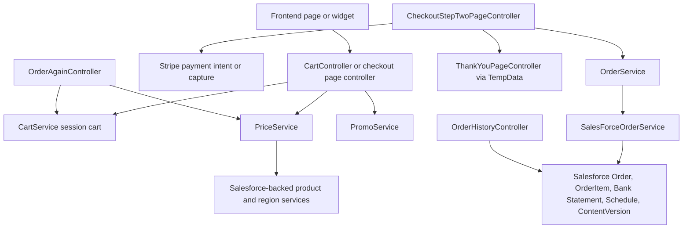
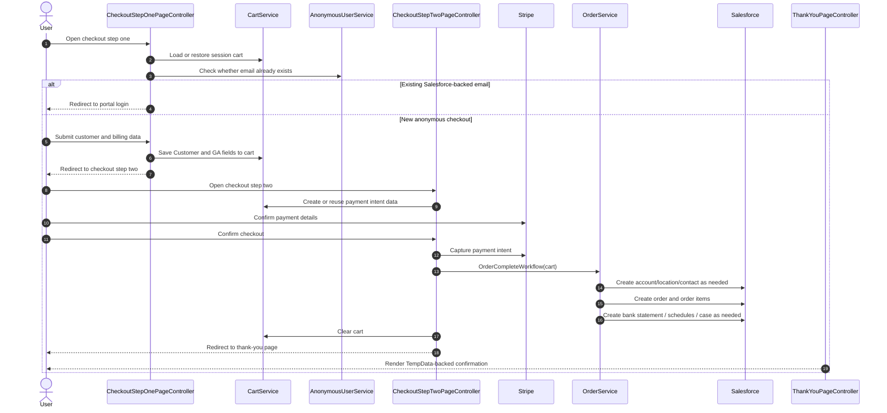
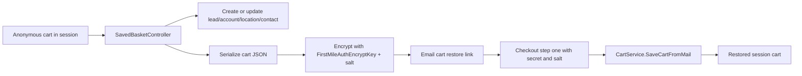
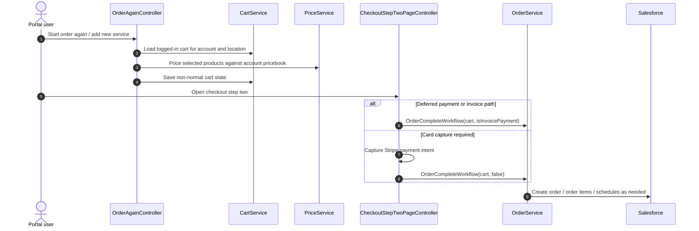
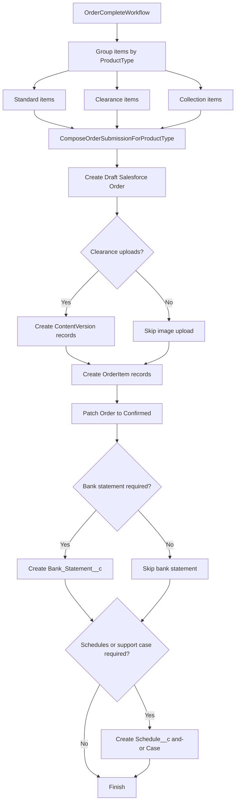

# Cart And Order Flow

This chapter documents the implemented cart, checkout, payment, and order-submission flow as it exists in the current codebase.

## Scope

This flow spans four different concerns:

- session cart persistence in `CartService`
- price and promo application in `PriceService` and `PromoService`
- checkout page flow in `CheckoutStepOnePage` and `CheckoutStepTwoPage`
- order submission into Salesforce-backed records in `OrderService` and `SalesForceOrderService`

It also overlaps with portal order history, reorder, and saved-basket recovery flows.

## System view

This is not a stateless order API. The lifecycle is driven by a session cart that is progressively enriched, repriced, and finally converted into Salesforce records.

## Core state model

The cart is stored in ASP.NET Core session under the fixed key `DefaultCart`.

### `Cart`

The `Cart` model contains the order-building state, not only a list of items. Important verified fields include:

- `items`: current line items
- `removedItems`: temporarily removed or unavailable items
- `Customer`: checkout customer data
- `ParentAccount`: logged-in parent account snapshot
- `ReorderContext`: account, location, contact, payment-method, and PO requirements for logged-in users
- `Payment`: payment intent, captured payment, invoice ids, PO number, and marketing preferences
- `Type`: normal cart, order again, book collection, or add new service
- `PromoCode` and computed discount totals
- `PostOpportunityRequest`: GA and attribution fields collected during anonymous checkout

### `LineItem`

Each line item carries both user-facing and Salesforce-facing data:

- UI inputs such as quantity, schedule, first collection, description, and postcode
- pricing fields such as `hiddenPrice`, `Discount`, `DiscountPrice`, and formatted `price`
- Salesforce-facing fields such as `ProductId`, `PriceBookEntryId`, `ProductType`, `ProductCategory`, and `Supplier`

The same object is used throughout cart display, repricing, checkout summary, and order submission.

## Flow 1: anonymous cart lifecycle

Anonymous users operate on a pure session cart.

### Load cart

`CartService.GetAnonymousCart()`:

1. reads session key `DefaultCart`
2. creates a new empty cart if the session is empty
3. discards the session cart and recreates it if `UserName` is populated, which prevents a logged-in cart from leaking into anonymous use

### Add items

`CartController.AddToCart()`:

1. loads the current cart from session
2. preserves cart type for non-normal flows such as reorder or book collection
3. restores metadata from `removedItems` for non-normal flows
4. calls `PriceService.GetPrice()` to produce priced line items
5. merges new items into existing cart lines or appends them
6. recalculates VAT context from either the service page or the home page
7. saves the mutated cart back to session

For anonymous users, the response shape varies:

- if promo is enabled on `HomePage`, the controller returns a `MiniCart` payload with CTA labels and URLs
- otherwise it returns either the newly added priced item set or the full cart depending on `full` and item count

### Update items

`CartController.UpdateCart()` mutates the existing line item in session, then calls `PriceService.GetPrice()` again on the updated cart to rebuild pricing. This means quantity, schedule, and first-collection changes are repriced rather than adjusted with local math only.

### Delete items

`CartController.DeleteCart()` removes a line item, clears `removedItems`, resets `oldTotalPrice`, and saves the session cart.

### Reprice by postcode

`CartController.UpdateCartByPostCode()` updates the postcode on every cart line, reprices the cart, and moves zero-priced items into `removedItems` with an unavailability reason before saving the new cart.

## Flow 2: logged-in portal cart lifecycle

Logged-in users do not use a purely anonymous session cart. The cart is rebound to current account and location context on each load.

### Load cart

`CartService.GetLoggedInCartAsync()`:

1. resolves account id from the current user if none is supplied
2. resolves location id from location selection state or the user’s live locations
3. verifies the location belongs to the account unless `allowNull` is requested
4. stores the selected location back into the location service
5. loads current contact and account details
6. creates a new session cart if none exists
7. recreates the session cart if the existing cart belongs to a different account or location
8. stamps the cart with account, contact, location, pricebook, account payment method, PO requirement, and customer addresses

This means the session cart still exists for logged-in users, but it is treated as account/location-scoped session state rather than a global browser cart.

### Reorder and service-add flows

For non-normal cart types, `PriceService.GetPrice()` requires both account id and location id and routes into `GetPriceForOrderAgain()`. That method prices using the selected account pricebook, subscribed products, account discounts, bid allocation discounts, and supplier overrides.

The current implementation treats reorder pricing differently from anonymous pricing because it assumes an existing commercial relationship, existing account context, and a known pricebook.

## Pricing flow

`PriceService` is the boundary between cart mutation and price discovery.

### Anonymous pricing

`GetPriceForAnonymousUser()`:

1. loads regions from line-item postcodes
2. loads product variants, product groups, and service pages from CMS content
3. maps postcode and product codes to region zone and pricebook
4. loads matching products and supplier products from Salesforce-backed services
5. builds priced `LineItem` objects, including VAT, pricebook entry id, product id, product category, payment period, and tooltip data

### Logged-in pricing

`GetPriceForOrderAgain()`:

1. loads the current account and cart
2. uses the cart pricebook id to load pricebook entries by product code
3. loads products and discounts for account or partnership context
4. applies bid-allocation and account-discount rules where relevant
5. rebuilds cart items with the correct Salesforce identifiers and display fields

### Important implementation note

`PriceService` contains an explicit TODO stating that postcode handling currently lives at the line-item level and should be refactored to cart-level input after the UI is completed. That means postcode behavior is currently more complex than the intended future model.

## Entry points and contract surface

The cart and order lifecycle is entered through a mix of API endpoints and page-controller routes.

| Entry point                               | Type | Role in lifecycle                                                |
| ----------------------------------------- | ---- | ---------------------------------------------------------------- |
| `/api/cart`                               | API  | load, add, update, delete, and reprice cart state                |
| `/api/paymentintent`                      | API  | return Stripe payment bootstrap data                             |
| `/api/mini-cart-email-form`               | API  | persist saved-basket recovery state and email a restore link     |
| `/api/order-history`                      | API  | read past orders for a selected location                         |
| `/api/order-items`                        | API  | read line items for one order                                    |
| `/api/order-again`                        | API  | preconfigure reorder or add-service steps                        |
| `CheckoutStepOnePageController.Index()`   | page | capture anonymous customer and attribution data                  |
| `CheckoutStepTwoPageController.Index()`   | page | present payment or invoice UI configuration                      |
| `CheckoutStepTwoPageController.Confirm()` | page | capture payment, submit order workflow, clear cart, and redirect |
| `ThankYouPageController.Index()`          | page | render post-purchase summary from `TempData`                     |

Two important implementation details stand out:

- step two can also create Stripe bootstrap data directly through `PaymentMethod(...)`, not only through `/api/paymentintent`
- anonymous checkout and logged-in reorder both end at the same order-submission service, even though the earlier cart flows differ substantially

## Promo flow

Promo handling is limited to anonymous cart behavior in the current implementation.

`PromoService.ApplyPromo()`:

1. loads the anonymous cart directly from session
2. resolves the matching `PromoCodePage` from the configured promo-page parent on `HomePage`
3. validates start and expiry dates
4. sets `Discount`, `SendUnitPriceToSalesforce`, and `UnitPricePriceAfterDiscount` on eligible line items
5. clears discount state and `PromoCode` when the promo is invalid
6. saves the updated cart back into session

`CheckoutStepOnePageController` reapplies the stored promo code when the anonymous checkout page loads, and `CartController.AddToCart()` can reapply the promo after adding items when promo is enabled.

## Checkout flow

### Step 1: customer and attribution capture

`CheckoutStepOnePageController.Index()` handles anonymous checkout data capture.

Important verified behavior:

- logged-in Salesforce users are immediately redirected to checkout step two
- `secret` and `salt` query parameters can restore a cart from an emailed saved-basket link through `CartService.SaveCartFromMail()`
- anonymous checkout blocks progression if the submitted email already exists in Salesforce account data and redirects to the portal login
- the controller stores customer contact, company, shipping address, billing address, and GA attribution data into the session cart
- after saving those fields, it redirects to the configured checkout step two page

### Anonymous checkout sequence

### Saved-basket recovery

`SavedBasketController` lets anonymous users email themselves a basket link.

Important verified behavior:

- it rejects logged-in Salesforce users because the flow is anonymous only
- it stamps customer identity into the session cart before emailing
- it creates or updates Salesforce lead/account/location/contact records as needed
- it serializes the cart JSON, encrypts it with `FirstMileAuthEncryptKey` plus a generated salt, and emits a link back to the cart page with `secret` and `salt`
- that link is later consumed by checkout step one through `SaveCartFromMail`

## Payment flow

### Payment intent creation

The intended payment flow is:

1. frontend requests `/api/paymentintent`
2. `PaymentIntentController.Create()` loads the current cart
3. `CartService.SaveCartWithPaymentIntent()` calculates the order amount and asks `IStripeService` to create a payment intent
4. the cart stores `PaymentIntentId`, Stripe customer id, invoice ids, invoice-item map, and amount
5. the endpoint returns Stripe `clientSecret` and publishable key to the frontend

The page-based checkout path can also generate Stripe bootstrap data without calling `/api/paymentintent`. `CheckoutStepTwoPageController.PaymentMethod(...)` calls `cartService.SaveCartWithPaymentIntent(cart)` and returns a frontend configuration object containing:

- publishable key
- Stripe client secret
- billing details seeded from the cart billing address
- the confirm redirect URL

### Implementation risk

`PaymentIntentController.Create()` currently calls `cartService.SaveCartWithPaymentIntent(cart)` without awaiting it, even though the method returns `Task<string>`. The intended flow is clear, but this action currently contains an async mismatch and should be treated as an implementation risk when documenting or debugging payment-intent creation.

### Capture during confirmation

`CheckoutStepTwoPageController.Confirm()` handles payment capture and order submission.

Verified sequence:

1. load current cart and fail if it is empty
2. stash line items and summary values in `TempData` for the thank-you page
3. determine whether the flow is invoice payment for eligible logged-in users with normal account payment method and order total of at least `1000`
4. if the cart is not deferred-payment and total is positive and this is not invoice payment, capture the Stripe payment intent
5. persist marketing preferences and optional PO number into `cart.Payment`
6. call `orderService.OrderCompleteWorkflow(cart, isInvoicePayment)`
7. trigger an order-confirmation email to the configured recipient
8. clear the session cart
9. redirect to the configured thank-you page

### Logged-in reorder and deferred-payment sequence

## Order submission workflow

`OrderService.OrderCompleteWorkflow()` is the main post-payment orchestration entry point.

### Phase 1: initialize contextual data

The workflow begins by loading:

- region from the first line item postcode
- national vs non-national location status
- product categories
- account, location, and contact ids as needed

### Phase 2: account, location, and contact handling

The service has three main branches.

#### Anonymous new user

If the cart is not logged in and there is no existing contact account:

1. close or update lead where possible
2. create parent account
3. create opportunity
4. create location
5. create or link contact

#### Anonymous prospect with existing contact/account relationship

If the cart is not logged in but a contact already exists:

1. update account details
2. ensure finance-contact relationship on the parent account
3. create or update location for the postcode
4. ensure opportunity exists and mark ecommerce-assisted state

#### Logged-in reorder or portal user

If the cart is logged in:

- reuse `ParentAccountId`, `LocationId`, and `ContactId` from `ReorderContext`
- update contact preferences when marketing preferences were captured
- update account with Stripe id when present

### Phase 3: order and payment records

The service groups line items by product type:

- standard
- clearance
- collection

It then submits each group through `ComposeOrderSubmissionForProductType(...)`, which is part of the order-orchestration pipeline beyond the excerpt inspected here. After at least one order id exists, the service can create a bank statement when:

- payment is not deferred
- cart total is positive
- this is not invoice-payment mode

### `ComposeOrderSubmissionForProductType(...)` internals

This method is the core record-creation routine for each product-type bucket.

Verified sequence:

1. return immediately if there are no line items for that product type
2. skip collection-order creation entirely for national regions
3. choose the pricebook from the cart or the region depending on cart type
4. require a non-empty `OptimizelyTransactionId`
5. create a Salesforce `Order` in `Draft` status with payment reference, promo code, supplier, and requested delivery date
6. attach uploaded images for clearance orders through Salesforce `ContentVersion`
7. create one Salesforce `OrderItem` per line item
8. apply special rules for zero-priced national collection behavior, discounted unit price, partner list price, and supplier override
9. patch the Salesforce order status from `Draft` to `Confirmed`

The explicit Salesforce object writes performed through `SalesForceOrderService` are:

- `Order`
- `OrderItem`
- `Bank_Statement__c`
- `Schedule__c`
- `ContentVersion`
- `Opportunity`

### Order submission diagram

### Requested delivery date rules

The order request does not use one universal delivery-date rule.

- clearance orders use product-specific first collection when present
- logged-in flows with first-collection values can carry those values through
- add-new-service flows can force the next working day
- the fallback is the next working day computed by `GetNextWorkingDay(...)`

### Collection schedule rules

`CollectionSchedule(...)` only creates schedules when:

- the line item has schedule days
- the supplier/product lookup succeeds
- `firstCollection` is present

For non-national, non-glass cases the schedule can use supplier-product ids; otherwise it uses the product id directly.

### Phase 4: schedules and cases

If the user is not simply reordering against an existing live location, or the cart type is `AddNewService`, the workflow may:

- create collection schedules for scheduled variants
- create a support case for national accounts or non-national carts containing glass products

### Phase 5: cache invalidation

If account-level state changed during the order workflow, the current user cache is cleared.

## Thank-you page and analytics completion

The thank-you page does not rebuild the cart. It uses `TempData` populated in checkout step two.

`ThankYouPageController.Index()`:

- deserializes line items from `TempData["LineItems"]`
- reads total, tax, email, and phone from `TempData["Others"]`
- emits a transaction-style ecommerce data layer payload for analytics

Because the cart is cleared before redirecting, `TempData` is the final bridge between checkout confirmation and thank-you rendering.

## Order history and reorder flow

### Order history

`OrderHistoryController` is the post-purchase read model for the portal.

Verified behavior:

- requires a logged-in Salesforce user through `SalesforceAuthorize`
- verifies access to the requested location
- stores the selected location in the location service
- returns paged orders, related order items, delivery package data, and POD link information shaped for the frontend

### Order again

`OrderAgainController` seeds reorder and service-add journeys.

Verified behavior:

- requires Salesforce-authorized account access
- binds the selected location into the cart context
- loads a logged-in cart scoped to that account/location
- returns frontend-ready step definitions such as variation picker and date picker payloads
- for special flows like `order-products-v2`, preloads eligible reorder items and persists `removedItems` metadata for later cart reconstruction

This means reorder is not a separate ordering subsystem. It is a specialized way to preconfigure the same cart session with account-aware pricing and product rules.

`OrderAgainController` also shows that the reorder API is partly a UI-composition endpoint. It returns structures like variation pickers, date pickers, and button content instead of only domain records, so frontend reorder behavior depends on backend-generated step definitions.

## Verified caveats

- `CartController` explicitly documents that too much cart business logic still lives in the controller rather than `CartService`.
- Price discovery currently depends on line-item postcode state, which the code itself marks as transitional.
- Payment-intent creation has an async mismatch in `PaymentIntentController`.
- Anonymous and logged-in flows share the same session cart key, but the service layer actively recreates carts when account or user context does not match.

## Source anchors

- `firstmile.web/Api/CartController.cs`
- `FirstMile.Services/Commerce/CartService.cs`
- `FirstMile.Services/Commerce/PriceService.cs`
- `FirstMile.Services/Commerce/PromoService.cs`
- `firstmile.web/Api/PaymentIntentController.cs`
- `firstmile.web/Features/CheckoutStepOnePage/CheckoutStepOnePageController.cs`
- `firstmile.web/Features/CheckoutStepTwoPage/CheckoutStepTwoPageController.cs`
- `FirstMile.Services/OrderService.cs`
- `FirstMile.Services/Salesforce/Order/SalesForceOrderService.cs`
- `firstmile.web/Api/OrderHistoryController.cs`
- `firstmile.web/Api/OrderAgainController.cs`
- `firstmile.web/Api/SavedBasketController.cs`
- `firstmile.web/Features/ThankYouPage/ThankYouPageController.cs`
These files are the primary verified sources for the current cart and order lifecycle documentation.
<!-- cart-order-flow-end -->